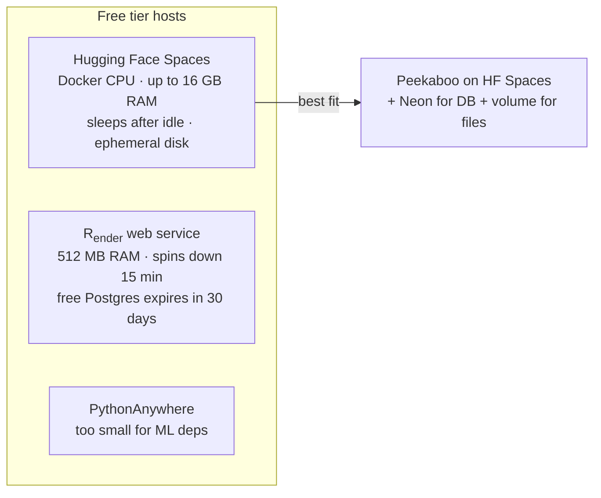

# 🚀 Deployment plan — laptop first, then free cloud

The project is built in **two phases with the same codebase**; only environment
variables and one or two pluggable components change.

```mermaid
flowchart TB
    subgraph PHASE1[Phase 1 — Laptop · "more resources" mode]
        APP1[FastAPI + InsightFace buffalo_l<br/>det_size 640 · full-res uploads]
        DB1[(Local Postgres 16 + pgvector<br/>docker · port 5433)]
        FS1[(Local disk data/)]
        APP1 --> DB1
        APP1 --> FS1
    end

    subgraph PHASE2[Phase 2 — Free cloud · "deployment constraints" mode]
        APP2[FastAPI on free host<br/>Docker image]
        DB2[(Neon Postgres<br/>pgvector + HNSW · free tier)]
        FS2[(Cloudflare R2<br/>S3-compatible · 10 GB free · zero egress)]
        APP2 --> DB2
        APP2 --> FS2
    end

    PHASE1 -->|same code · DATABASE_URL + S3_* env swap<br/>FACE_MODEL=buffalo_s · DET_SIZE=512| PHASE2
```

---

## Phase 1 (done) — laptop

Optimized for **maximum accuracy**, bounded only by the laptop:

* `FACE_MODEL=buffalo_l` (best ArcFace weights) and `DET_SIZE=640`.
* Full-resolution uploads (`MAX_IMAGE_SIDE=2048`).
* Local Postgres + pgvector — same schema and queries as Neon.

## Phase 2 — deployment constraints

Free-tier hosts give you almost nothing, so the deployment plan is a series of
**resource trade-offs**:

| Constraint | Strategy |
|---|---|
| RAM (~0.5–2 GB) | `FACE_MODEL=buffalo_s`, `DET_SIZE=512`; quantized ONNX if needed |
| Cold starts | Load the model lazily (already implemented) or warm with a scheduled ping |
| Ephemeral disk | Keep `data/` on a mounted volume, or move to object storage |
| DB sleeping (Neon: 5 min idle) | Acceptable — cold start ~350 ms; keeps 100 CU-hrs/month intact |
| CPU-seconds | Downscale aggressively; consider an image queue + worker later |

### Candidate free hosts (researched 2026)



**Recommendation: Hugging Face Spaces (Docker SDK)** — by far the most RAM for
free; pair it with Neon (already the DB) and a persistent volume or object
storage for uploaded files.

### Migration checklist

- [ ] Add `Dockerfile` (install `requirements.txt`, build `web/` with `npm ci && npm run build`, copy `web/dist` + `app/`, bundle or pre-download models).
- [ ] Add `DATABASE_URL` (Neon pooled string), `S3_*` (R2), `PUBLIC_BASE_URL` to Space secrets.
- [ ] Set `STORAGE_BACKEND=s3` + R2 endpoint/keys (already supported — bucket auto-creates).
- [ ] Set `FACE_MODEL=buffalo_s`, `DET_SIZE=512`, `MAX_IMAGE_SIDE=1024`.
- [ ] Add a keep-alive ping (every 4 min) if always-on matters.
- [ ] Put the app behind a reverse proxy (HTTPS) — Spaces provides it.

---

## Cost breakdown (Phase 2)

| Service | Free tier | Annual cost |
|---|---|---|
| Hugging Face Spaces | CPU Docker, sleeps when idle | $0 |
| Neon Postgres | 0.5 GB, pgvector + HNSW, ~100 CU-hrs/mo | $0 |
| Cloudflare R2 (photos) | 10 GB storage + **zero egress** | $0 |
| **Total** | | **$0 / year** |

### Switching storage backends (already implemented)

```bash
# Local dev with MinIO (S3 API, same code path as production)
STORAGE_BACKEND=s3 S3_ENDPOINT_URL=http://localhost:9000 \
  S3_ACCESS_KEY=minioadmin S3_SECRET_KEY=minioadmin S3_REGION=us-east-1

# Production with Cloudflare R2
STORAGE_BACKEND=s3 \
  S3_ENDPOINT_URL=https://<ACCOUNT_ID>.r2.cloudflarestorage.com \
  S3_ACCESS_KEY=<R2_ACCESS_KEY> S3_SECRET_KEY=<R2_SECRET> S3_REGION=auto
```

Both use boto3 + the S3 API; the bucket auto-creates on first use.

> Neon's free tier sleeps after 5 min idle (wakes in ~350 ms). Supabase was
> considered but has a 1-week inactivity pause on free; Neon's resume is much
> friendlier for an app used sporadically.

---

## Auth & multi-tenancy (implemented)

Every account is a **tenant**: each user gets their own photo library, and all
face searches / claim lookups are scoped to that tenant (verified live: two
accounts uploading photos of the *same person* only ever see their own).

* Email/password signup + login (bcrypt hashes, JWT sessions in httpOnly cookies).
* Optional **Google SSO** (OAuth 2.0) — off by default, enabled by setting
  `GOOGLE_CLIENT_ID` + `GOOGLE_CLIENT_SECRET`.
* Lightweight in-memory rate limiter on auth endpoints (5/min per IP).
* Claims are unauthenticated by design (share links) but token-gated.

### Setting up Google SSO

1. Google Cloud Console → APIs & Services → **Credentials → Create OAuth client ID**
   (Web application).
2. Authorized redirect URI: `{PUBLIC_BASE_URL}/api/auth/google/callback`
   (e.g. `http://localhost:8000/api/auth/google/callback` for local dev).
3. Add `GOOGLE_CLIENT_ID` / `GOOGLE_CLIENT_SECRET` to `.env`.
4. Restart the app — the Google button appears on the auth page.

### Production auth checklist

- [ ] Generate a real `JWT_SECRET` (`python -c "import secrets; print(secrets.token_hex(32))"`).
- [ ] Set `COOKIE_SECURE=true` (HTTPS only).
- [ ] SameSite=strict cookies — already set; do not loosen.
- [ ] In-memory rate limiter resets on restart — swap for a DB-backed limiter
      when deploying to multiple workers.

---

## Security checklist

- [x] Claim tokens are `secrets.token_urlsafe(18)` (~128 bits) — unguessable.
- [x] Token-gated image serving (`photo_accessible` / `face_crop_accessible`).
- [x] Path-traversal guard in storage keys.
- [x] Upload size + type validation; server-side downscaling.
- [x] Rate limiting on auth endpoints (in-memory, 5/min per IP) — upgrade to DB-backed for multi-worker.
- [ ] Add request size limits at the reverse proxy.
- [ ] Run over HTTPS only; set `PUBLIC_BASE_URL`.
- [ ] Consider expiring tokens / selfie-retention policy.
