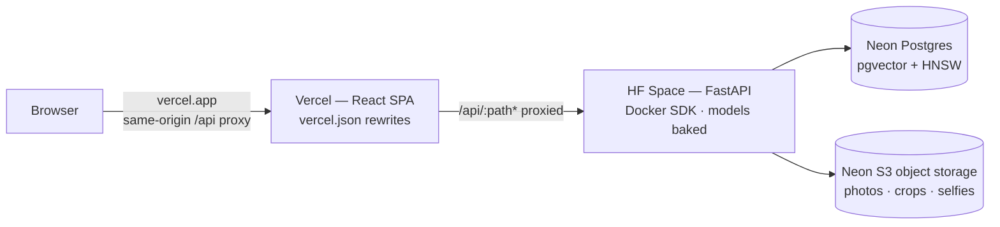

# 🚀 Deployment plan — laptop, free cloud, or your own hardware

> **Prefer running everything on your own machine / external drive / NAS?**
> There's a one-command Docker Compose suite — app + Postgres + MinIO — with
> all data under a single swappable `DATA_ROOT` folder:
> **[SELFHOST.md](SELFHOST.md)**

---

# 🚀 Deployment plan — laptop first, then free cloud

The project is built in **two phases with the same codebase**; only environment
variables and one or two pluggable components change.

```mermaid
flowchart TB
    subgraph PHASE1[Phase 1 — Laptop · "more resources" mode]
        APP1[FastAPI + InsightFace buffalo_l<br/>det_size 640 · full-res uploads]
        DB1[(Local Postgres 16 + pgvector<br/>docker · port 5433)]
        FS1[(Local disk data/)]
        APP1 --> DB1
        APP1 --> FS1
    end

    subgraph PHASE2[Phase 2 — Free cloud · "deployment constraints" mode]
        APP2[FastAPI on free host<br/>Docker image]
        DB2[(Neon Postgres<br/>pgvector + HNSW · free tier)]
        FS2[(Cloudflare R2<br/>S3-compatible · 10 GB free · zero egress)]
        APP2 --> DB2
        APP2 --> FS2
    end

    PHASE1 -->|same code · DATABASE_URL + S3_* env swap<br/>FACE_MODEL=buffalo_s · DET_SIZE=512| PHASE2
```

---

## Phase 1 (done) — laptop

Optimized for **maximum accuracy**, bounded only by the laptop:

* `FACE_MODEL=buffalo_l` (best ArcFace weights) and `DET_SIZE=640`.
* Full-resolution uploads (`MAX_IMAGE_SIDE=2048`).
* Local Postgres + pgvector — same schema and queries as Neon.

## Phase 2 — deployment constraints

Free-tier hosts give you almost nothing, so the deployment plan is a series of
**resource trade-offs**:

| Constraint | Strategy |
|---|---|
| RAM (~0.5–2 GB) | `FACE_MODEL=buffalo_s`, `DET_SIZE=512`; quantized ONNX if needed |
| Cold starts | Load the model lazily (already implemented) or warm with a scheduled ping |
| Ephemeral disk | Keep `data/` on a mounted volume, or move to object storage |
| DB sleeping (Neon: 5 min idle) | Acceptable — cold start ~350 ms; keeps 100 CU-hrs/month intact |
| CPU-seconds | Downscale aggressively; consider an image queue + worker later |

## Phase 2 (ready to deploy) — Hugging Face Spaces + Vercel + Neon

**Architecture:** stateless backend on HF Spaces, frontend on Vercel, all data
in your existing Neon (Postgres + S3-compatible object storage). HF's free tier
has **no persistent disk**, so models are baked into the image and every byte of
user data lives in Neon — the app container is disposable.



Same-origin from the browser's perspective: Vercel rewrites proxy `/api/*` and
`/health` to the Space, so the httpOnly session cookie (SameSite=Lax) just
works — no CORS, no cross-site cookie gymnastics.

### Deploy the backend (one command)

```bash
HF_TOKEN=hf_xxxx ./scripts/deploy_space.sh your-user/peekaboo
```

The script creates the Space (sdk=docker), assembles the repo (multi-stage
Dockerfile builds the SPA and bakes the ML models so cold starts don't re-download
370 MB), and pushes — HF builds the image. Then set the **secrets** in
Space → Settings → Variables and secrets:

| Variable | Value |
|---|---|
| `DATABASE_URL` | Neon pooled string (already in your `.env`) |
| `STORAGE_BACKEND` | `s3` |
| `AWS_ENDPOINT_URL_S3` / `AWS_ACCESS_KEY_ID` / `AWS_SECRET_ACCESS_KEY` / `AWS_REGION` / `S3_BUCKET` | Neon S3 (already in your `.env`) |
| `JWT_SECRET` | `openssl rand -hex 32` |
| `COOKIE_SECURE` | `true` |
| `PUBLIC_BASE_URL` | your Vercel domain (absolute links) |
| `FACE_MODEL` / `DET_SIZE` | `buffalo_l` / `640` — drop to `buffalo_s`/`512` if the build times out |

Free-tier notes: **2 vCPU / 16 GB RAM**, sleeps after 48 h idle, first request
after waking takes up to ~2 min. Don't add a keep-alive — waking is free.

### Deploy the frontend (Vercel)

```bash
cd web
vercel          # or: npx vercel --prod
```

1. Edit `web/vercel.json` and replace `<YOUR-USERNAME>-peekaboo.hf.space` with
   the real Space URL.
2. Vercel auto-detects Vite (build `npm run build`, output `dist`).
3. `vercel.json` rewrites `/api/:path*` and `/health` to the Space and falls
   back every other path to `index.html` (client routes like `/photos` and
   `/claim/<token>` work on refresh).
4. Set `PUBLIC_BASE_URL=https://<your-project>.vercel.app` on the Space so
   absolute links are correct.

**Vercel Hobby free tier:** 100 GB bandwidth / month — fine until the photo
library gets heavy; images are the main cost driver.

### Why HF + Vercel + Neon

| Constraint | Choice | Reason |
|---|---|---|
| Backend RAM | HF Spaces (16 GB free) | by far the most RAM of any free host; models + inference fit |
| Storage | Neon S3 + Postgres | free tier, already configured, survives Space restarts |
| Frontend | Vercel | free, CDN-fast SPA, rewrite proxy keeps auth same-origin |
| Cold starts | models baked in | first request after sleep is a container boot, not a download |

> Alternative single-host: the [SELFHOST.md](SELFHOST.md) Docker Compose suite
> on your own hardware (no cloud at all).

### Migrating the existing local library

After the Space is live, copy your local data up once:

```bash
# from the laptop: upload local data/ into Neon S3 (see SELFHOST.md)
STORAGE_BACKEND=s3 .venv/bin/python scripts/migrate_local_to_s3.py
# or mirror between S3 stores with mc
```

---

## Cost breakdown (Phase 2)

| Service | Free tier | Annual cost |
|---|---|---|
| Hugging Face Spaces | CPU Docker (2 vCPU / 16 GB), sleeps when idle | $0 |
| Neon Postgres | 0.5 GB, pgvector + HNSW, ~100 CU-hrs/mo | $0 |
| Neon S3 object storage | free tier | $0 |
| Vercel | Hobby — 100 GB bandwidth / mo | $0 |
| **Total** | | **$0 / year** |

### Switching storage backends (already implemented)

```bash
# Local dev with MinIO (S3 API, same code path as production)
STORAGE_BACKEND=s3 S3_ENDPOINT_URL=http://localhost:9000 \
  S3_ACCESS_KEY=minioadmin S3_SECRET_KEY=minioadmin S3_REGION=us-east-1

# Neon object storage (this project)
STORAGE_BACKEND=s3 \
  AWS_ENDPOINT_URL_S3=https://<project>.storage.<region>.aws.neon.tech \
  AWS_ACCESS_KEY_ID=<key> AWS_SECRET_ACCESS_KEY=<secret> AWS_REGION=us-east-2 \
  S3_BUCKET=pekaboo
```

Both use boto3 + the S3 API; the bucket auto-creates on first use.

---

## Auth & multi-tenancy (implemented)

Every account is a **tenant**: each user gets their own photo library, and all
face searches / claim lookups are scoped to that tenant (verified live: two
accounts uploading photos of the *same person* only ever see their own).

* Email/password signup + login (bcrypt hashes, JWT sessions in httpOnly cookies).
* Optional **Google SSO** (OAuth 2.0) — off by default, enabled by setting
  `GOOGLE_CLIENT_ID` + `GOOGLE_CLIENT_SECRET`.
* Lightweight in-memory rate limiter on auth endpoints (5/min per IP).
* Claims are unauthenticated by design (share links) but token-gated.

### Setting up Google SSO

1. Google Cloud Console → APIs & Services → **Credentials → Create OAuth client ID**
   (Web application).
2. Authorized redirect URI: `{PUBLIC_BASE_URL}/api/auth/google/callback`
   (e.g. `http://localhost:8000/api/auth/google/callback` for local dev).
3. Add `GOOGLE_CLIENT_ID` / `GOOGLE_CLIENT_SECRET` to `.env`.
4. Restart the app — the Google button appears on the auth page.

### Production auth checklist

- [ ] Generate a real `JWT_SECRET` (`python -c "import secrets; print(secrets.token_hex(32))"`).
- [ ] Set `COOKIE_SECURE=true` (HTTPS only).
- [ ] SameSite=strict cookies — already set; do not loosen.
- [ ] In-memory rate limiter resets on restart — swap for a DB-backed limiter
      when deploying to multiple workers.

---

## Security checklist

- [x] Claim tokens are `secrets.token_urlsafe(18)` (~128 bits) — unguessable.
- [x] Token-gated image serving (`photo_accessible` / `face_crop_accessible`).
- [x] Path-traversal guard in storage keys.
- [x] Upload size + type validation; server-side downscaling.
- [x] Rate limiting on auth endpoints (in-memory, 5/min per IP) — upgrade to DB-backed for multi-worker.
- [ ] Add request size limits at the reverse proxy.
- [ ] Run over HTTPS only; set `PUBLIC_BASE_URL`.
- [ ] Consider expiring tokens / selfie-retention policy.
