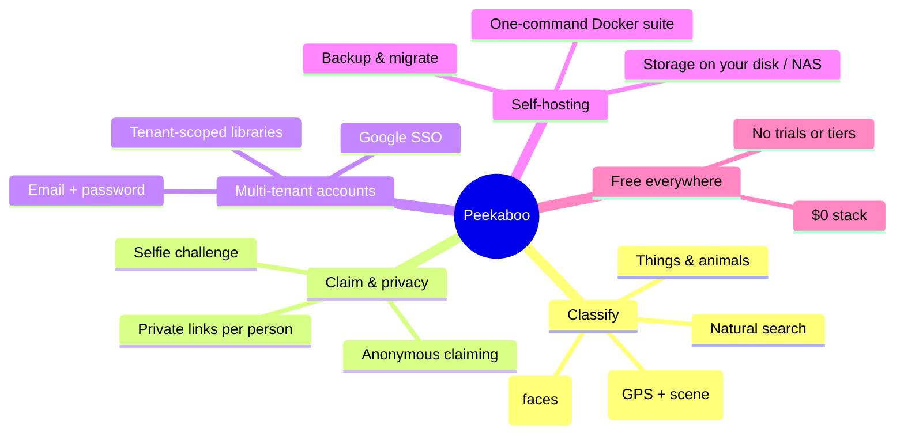
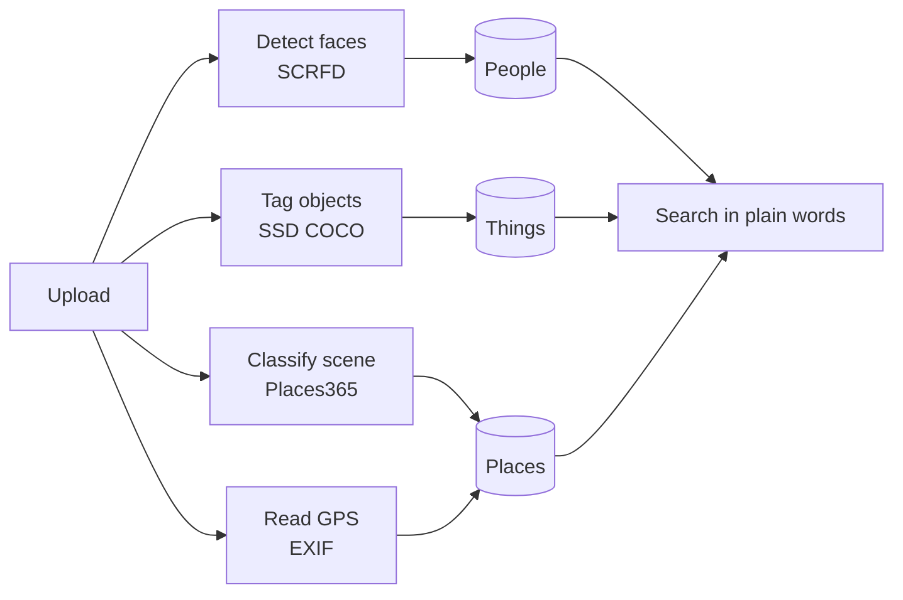
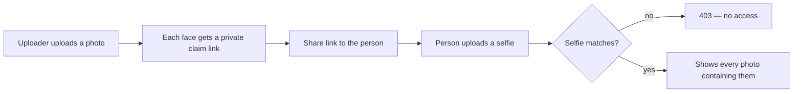
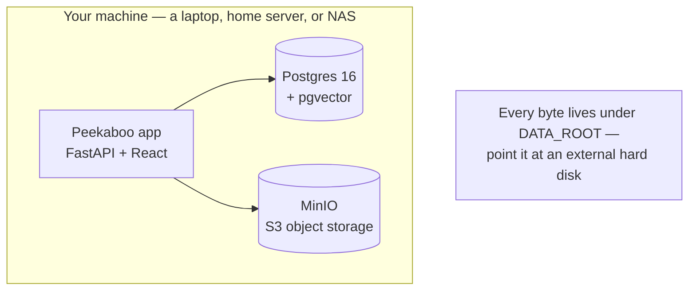

# ✨ Peekaboo — Feature sheet

Peekaboo is a **100% free** face-recognition photo library: upload a photo, every
person in it gets a private link, and after a selfie challenge each person sees
every photo containing them — nothing else.

This sheet describes what the product can do, with **self-hosting** documented as
one of its features (yes, you can run the whole thing yourself).

---

## Feature list at a glance



---

## 1. Classification — find any photo in seconds

Every upload is read automatically, in the background, without blocking the page:

| Feature | How it works | Model |
|---|---|---|
| **People** | Every face becomes a person; faces cluster into people; tap a person to see all their photos | InsightFace SCRFD + ArcFace (512-d) |
| **Places** | GPS read from EXIF and grouped into locations; no GPS? the scene is recognized instead | EXIF + Places365 ResNet-18 |
| **Things & animals** | Every object in the frame is tagged — dogs, cars, receipts, surfboards | SSD MobileNet V1 (COCO 80 classes) |
| **Natural search** | Type "mom", "beach", "receipts" — matches people, places and objects | vector search over all labels |



Enrichment is **optional and non-blocking** — if a model is missing or fails,
uploads still succeed.

## 2. Claim links & privacy

The core loop, and the privacy model behind it:



* A **claim token is the credential** — a 128-bit random secret minted per face.
* The person in the photo **never needs an account** — claiming stays anonymous.
* Photos and crops are only served to a token that belongs to a face in the photo
  (or one matching it beyond the similarity threshold).
* Verification selfies are stored for audit so a rejected claim can be reviewed.

## 3. Multi-tenant accounts

Like Google Photos: each account owns its own private library.

* Email/password (bcrypt) or **Google SSO** (OAuth 2.0).
* Sessions are JWT in an httpOnly, SameSite=Lax cookie — no tokens in JS.
* Every query is scoped by `tenant_id` — claim links only ever search inside the
  library they were minted from, even for the same face in another account.

## 4. Self-hosting — run it on your own hardware ✅

> **This is a supported feature, not a hack.** The entire product — app,
> database, and object storage — ships as a **one-command Docker Compose suite**
> that runs on any machine with Docker. Your photos never have to leave your
> hardware.



```bash
# one command — everything up, everything under one folder:
DATA_ROOT=/mnt/photos/peekaboo docker compose up -d
```

**What self-hosting gives you:**

| Capability | Details |
|---|---|
| **Data ownership** | DB, photos, crops, selfies and ML models all live under one `DATA_ROOT` folder — put it on an **external hard disk** or a **NAS** mount |
| **Portability** | Unplug the drive, plug it into another machine → the whole library comes back |
| **Storage swap** | Storage is S3 by design — swap local disk ⇄ MinIO ⇄ Neon ⇄ Cloudflare R2 with one env var, no code changes |
| **Library migration** | Built-in scripts to migrate a local-disk library to S3, or mirror S3→S3 with `mc mirror` |
| **Backups** | `pg_dump` for the DB + copy the `DATA_ROOT` folder — that's the whole product |
| **Weak-hardware tuning** | Switch to the lighter `buffalo_s` face model + smaller detection size for low-RAM machines |

Full guide: **[SELFHOST.md](SELFHOST.md)** — external-drive setup, NAS options,
migration, backups, and troubleshooting.

## 5. The stack, and why it's free

| Layer | Choice | Cost |
|---|---|---|
| Web framework | FastAPI + Uvicorn | free |
| Face engine | InsightFace (SCRFD + ArcFace, 512-d) | free, MIT |
| Object detection | SSD MobileNet V1 (ONNX) | free, Apache-2.0 |
| Scene classification | Places365 ResNet-18 (ONNX) | free, MIT/BSD |
| Database | Neon Postgres + `pgvector` (HNSW index) | free tier |
| Storage | MinIO / Cloudflare R2 / Neon S3 / local disk | free |

---

See **[README.md](README.md)** for setup, **[SELFHOST.md](SELFHOST.md)** to run it
yourself, **[DEPLOYMENT.md](DEPLOYMENT.md)** for the free-cloud deployment plan,
and **[TRADEOFFS.md](TRADEOFFS.md)** for the engineering reasoning behind every
choice.
