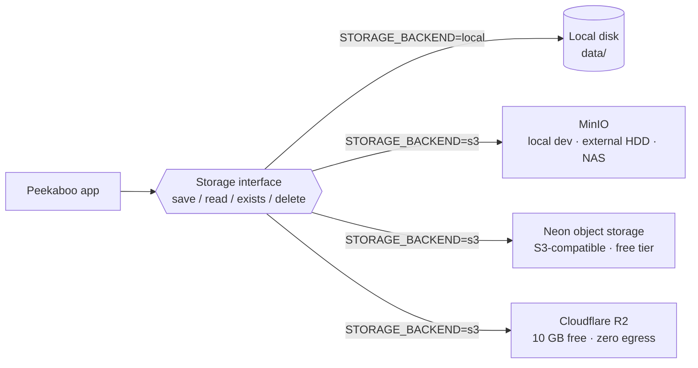
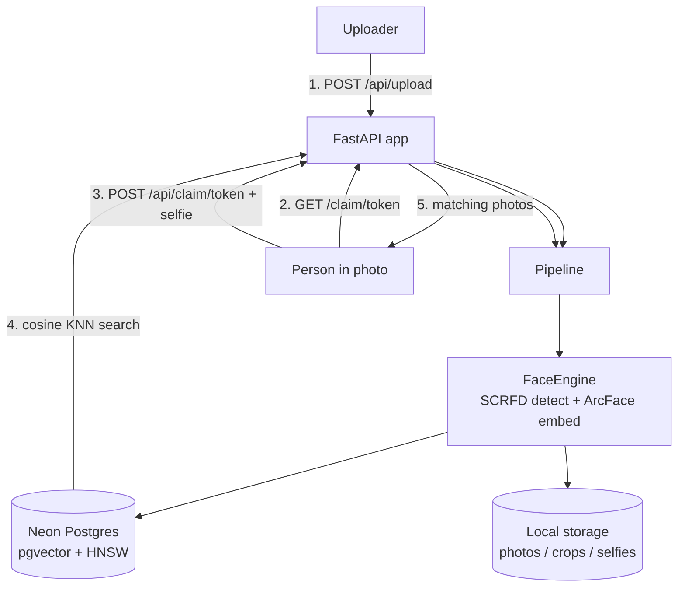
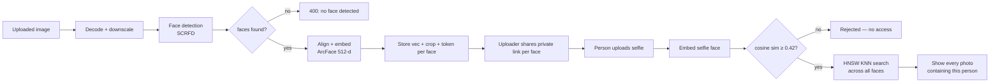
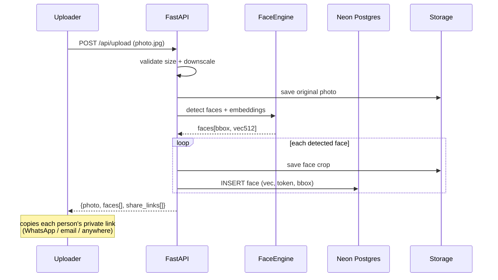
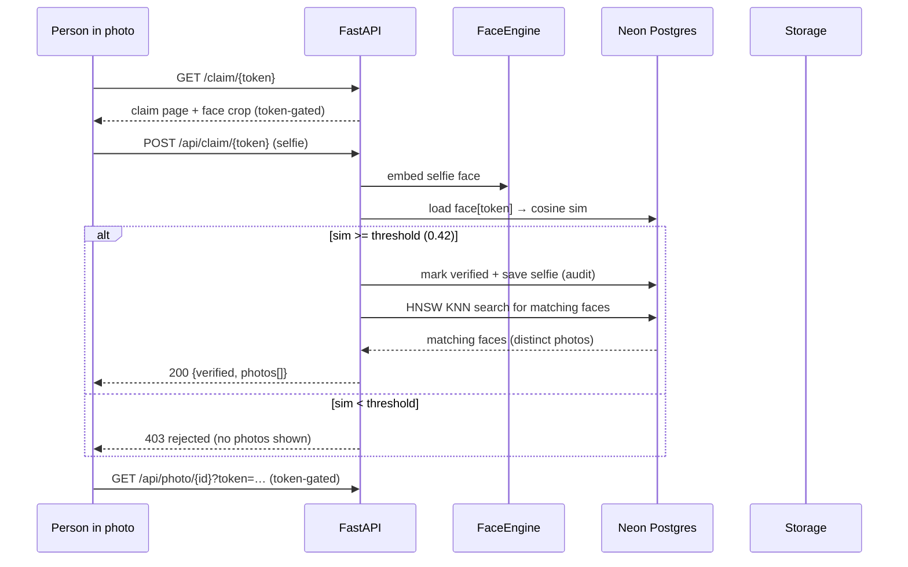
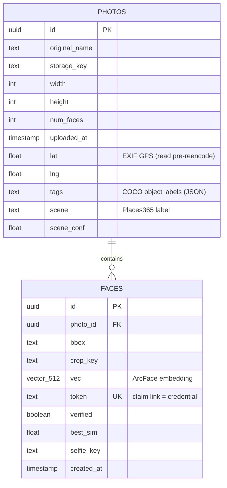
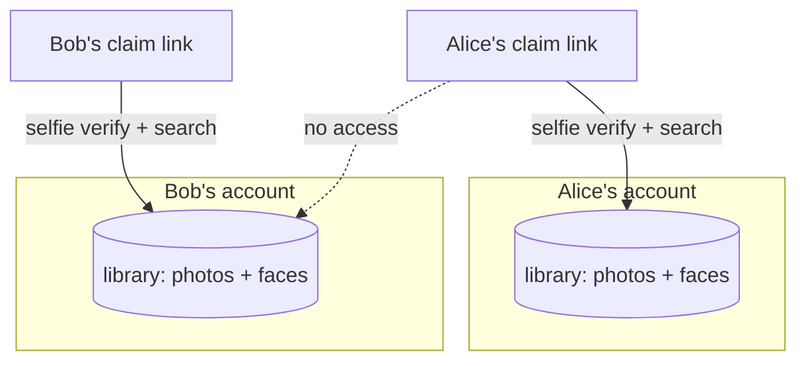
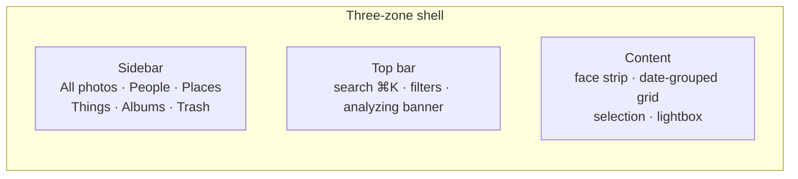

# 🫣 Peekaboo

**Upload a photo → every person in it gets a private link → after a selfie challenge, each person sees every photo containing them.**

A production-grade, **100% free** face-recognition pipeline:

| Layer | Choice | Cost |
|---|---|---|
| Web framework | FastAPI + Uvicorn | free |
| Face engine | InsightFace (SCRFD + ArcFace, 512-d) | free, MIT |
| Object detection | SSD MobileNet V1 (COCO 80 classes, ONNX) | free, Apache-2.0 |
| Scene classification | Places365 ResNet-18 (ONNX) | free, MIT/BSD |
| Database | Neon Postgres + `pgvector` (HNSW index) | free tier |
| Storage | MinIO / Cloudflare R2 (S3-compatible) or local disk | free |

> 📖 **Full feature list — including self-hosting on your own hardware — in
> [FEATURES.md](FEATURES.md).**

## Storage — S3-compatible by default

Images live behind one storage interface with two backends, switched by a
single env var (`STORAGE_BACKEND=local|s3`):



* **Local dev:** `STORAGE_BACKEND=local` (default) or MinIO in Docker — same S3 API as production.
* **Self-hosted suite:** `docker compose up -d` brings up the app + Postgres +
  MinIO on your own machine, with every byte under one `DATA_ROOT` folder you
  can point at an **external hard disk or NAS** — see [SELFHOST.md](SELFHOST.md).
* **Neon (this project):** Neon's **S3-compatible object storage** — copy the
  endpoint + access key/secret from Neon console (Storage → S3) and set
  `STORAGE_BACKEND=s3` with the standard AWS env names:
  `AWS_ENDPOINT_URL_S3`, `AWS_ACCESS_KEY_ID`, `AWS_SECRET_ACCESS_KEY`,
  `AWS_REGION`, and `S3_BUCKET` (per-project, e.g. `pekaboo`).
* **Alternative production:** Cloudflare R2 — **10 GB free, $0 egress**, same
  env-var wiring, zero code changes.
* Keys like `photos/<uuid>.jpg` are identical on every backend, and every key
  is validated against a strict pattern (no path traversal).

---

## How it works



The **classification challenge**:



### Upload flow (sequence)



### Claim flow (sequence)



### Data model



---

## Accounts & multi-tenancy

Peekaboo is multi-tenant like Google Photos: **each account owns its own photo
library**, and claim links only ever search inside the library they were minted
from — even for the same person's face in two different accounts.



* **Sign in:** email/password (bcrypt hashes) or **Google SSO** (OAuth 2.0).
* **Sessions:** JWT in an httpOnly, SameSite=Lax cookie — no token in JS.
* **Uploads** require an account (`POST /api/upload` → 401 without a session).
* **Claiming stays anonymous** — the person in the photo never needs an account.
* Every query is scoped by `tenant_id` (defense in depth, not just the URL).

### Enabling Google SSO

1. [Google Cloud Console](https://console.cloud.google.com/apis/credentials) →
   **Create OAuth client ID → Web application**.
2. Add the authorized redirect URI: `http://localhost:8000/api/auth/google/callback` (or your `PUBLIC_BASE_URL`).
3. Put the client ID/secret in `.env` (`GOOGLE_CLIENT_ID`, `GOOGLE_CLIENT_SECRET`).

---

## Privacy model

* A **claim token is the credential** — it's a 128-bit random secret minted per face.
* Photos and face crops are only served to a token that belongs to a face **in** the photo (or a face matching it beyond the similarity threshold).
* An uploader never sees other people's photos — only the photo they uploaded and the crops from it.
* Verification selfies are stored for audit so a rejected/wrong claim can be reviewed.
* No emails, no phone numbers, no accounts — fully anonymous.

> ⚠️ Face recognition has legal/privacy implications (e.g. GDPR, BIPA). Only process photos of people who consented to being in the system.

---

## Local setup (laptop, "more resources" mode)

**1. Clone & prepare**

```bash
cd Peekaboo
uv venv --python 3.12 .venv          # uv installs Python 3.12 if needed
source .venv/bin/activate
uv pip install -r requirements.txt   # first install downloads ~400MB of ML deps
```

**2. Start the free local services** (Postgres+pgvector on 5433, MinIO S3 on 9000):

```bash
docker run -d --name faceclaim-pg -p 5433:5432 \
  -e POSTGRES_PASSWORD=postgres -e POSTGRES_DB=faceclaim \
  pgvector/pgvector:pg16

docker run -d --name minio -p 9000:9000 -p 9001:9001 \
  -e MINIO_ROOT_USER=minioadmin -e MINIO_ROOT_PASSWORD=minioadmin \
  minio/minio server /data --console-address ":9001"
```

> Keep `STORAGE_BACKEND=local` (disk) for the simplest laptop run, or set it to
> `s3` with the MinIO endpoint to exercise the exact production storage path:
> `S3_ENDPOINT_URL=http://localhost:9000 S3_ACCESS_KEY=minioadmin S3_SECRET_KEY=minioadmin S3_REGION=us-east-1`.

**3. Configure**

```bash
cp .env.example .env   # DATABASE_URL already points at the local pgvector db
```

**4. Download sample faces (optional, for testing without your own photos)**

```bash
uv run python scripts/download_samples.py
```

**5. Build & run**

```bash
cd web && npm install && npm run build && cd ..   # React SPA -> web/dist
uv run uvicorn app.main:app --reload --port 8000
```

Open <http://localhost:8000> — FastAPI serves the built React app. On first
request the InsightFace model pack (`buffalo_l`, ~370 MB) downloads
automatically into `models/`.

> **Frontend dev with hot reload:** run `uvicorn` on port 8000 and
> `cd web && npm run dev` (port 5173, proxies `/api` to 8000).

### Test the whole loop with samples

| Step | File | Role |
|---|---|---|
| 1. Upload | `data/samples/two_people.jpg` | uploader |
| 2. Copy link | for either detected face | — |
| 3. Open `/claim/<token>` | — | person in photo |
| 4. Verify | `data/samples/obama.jpg` (the face from step 1) | passes |
| 5. Negative test | `data/samples/biden.jpg` on an Obama link | rejected |

Also upload `obama.jpg` and `obama2.jpg` as two *separate* photos, then claim one
link — both photos should appear in the gallery (cross-photo matching works).

---

## API reference

| Method | Route | Purpose |
|---|---|---|
| `GET` | `/` | React SPA (home / upload) |
| `GET` | `/claim/{token}` | React SPA (verify) — client-side route |
| `POST` | `/api/auth/signup` | `{email, password, name?}` → sets session cookie |
| `POST` | `/api/auth/login` | `{email, password}` → sets session cookie |
| `POST` | `/api/auth/logout` | Clears the session cookie |
| `GET` | `/api/auth/me` | Current user (or 401) |
| `GET` | `/api/auth/config` | Public capabilities (e.g. `google_sso` enabled?) |
| `GET` | `/api/auth/google` | Start Google SSO (redirect) |
| `GET` | `/api/auth/google/callback` | Google OAuth callback |
| `POST` | `/api/upload` | Multipart `file` (auth required) → `{photo, faces[]}` |
| `GET` | `/api/library` | Signed-in user's library: photos + people + places + things |
| `GET` | `/api/claim-info/{token}` | Face id + crop URL for the claim SPA |
| `POST` | `/api/claim/{token}` | Multipart selfie `file` → `{status, photos[]}` |
| `GET` | `/api/photo/{photo_id}?token=` | Token-gated original photo |
| `GET` | `/api/crop/{face_id}?token=` | Token-gated face crop |
| `GET` | `/health` | Liveness + DB check |

---

## UI redesign (Google-Photos-style library)

The signed-in experience is a three-zone app shell (sidebar · top bar · content):



* **All photos** — grid grouped by day with sticky headers; cells preserve
  aspect ratio (never square-cropped). Hover/Shift/Ctrl multi-select with a
  floating action bar (copy claim links).
* **People** — faces are clustered server-side (greedy similarity) into a
  horizontal avatar strip and a full People view; clicking a person filters
  the library to photos containing them.
* **Search & filters** — ⌘K command palette (people, places, objects, dates)
  and a filter popover (date ranges + people + places + things) rendered as
  removable badges.
* **Places** — photos group by GPS coordinates read from EXIF (clustered
  within ~2 km); photos without GPS get a Places365 scene label instead.
* **Things** — SSD MobileNet tags every photo with its COCO objects (animals,
  vehicles, furniture…); the Things view has an Animals section.
* **Lightbox** — fullscreen dialog with metadata (date, size, people-in-photo
  chips that filter, scene, object tags, GPS coords, copy claim link, download).
* **Uploads** — drag-and-drop dialog with per-batch progress and a
  non-blocking "Analyzing…" banner while faces are detected.
* Albums / Trash are nav views with designed empty states until those
  features ship.

Enrichment is **optional and non-blocking**: if an ONNX model is missing or
inference fails, uploads still succeed (classification simply stays off).
Photos uploaded before enrichment existed can be backfilled with
`scripts/backfill_enrichment.py` (GPS can't be recovered — the re-encoded
image has no EXIF — but tags and scenes can).

Stack: **Tailwind CSS v4 + shadcn/ui-style primitives + Phosphor icons**
(hand-scaffolded — the shadcn registry was unreachable in this environment,
so the components live in `web/src/components/ui/` and `components.json` is
ready for future `npx shadcn add`).

## Project structure

```
Peekaboo/
├── app/                  # FastAPI backend
│   ├── main.py          # API routes + React SPA serving
│   ├── pipeline.py      # upload → embed → token; claim → verify → search
│   ├── vision.py        # SSD MobileNet objects + Places365 scene (ONNX, lazy)
│   ├── library.py       # people clustering + places/things grouping
│   ├── face_engine.py   # InsightFace wrapper (lazy singleton)
│   ├── auth.py          # bcrypt, JWT sessions, Google SSO, rate limiter
│   ├── db.py            # SQLAlchemy + pgvector models, HNSW index
│   ├── storage.py       # storage interface: LocalStorage + S3Storage (MinIO/R2)
│   └── config.py        # env-driven settings
├── web/                  # React SPA (Vite + TypeScript + Tailwind + shadcn/ui)
│   ├── src/auth.tsx     # AuthContext (session state, login/signup/logout)
│   ├── src/pages/       # LibraryPage (grid), PeoplePage, ClaimPage, ComingSoon
│   ├── src/components/  # Sidebar, TopBar, FaceStrip, Lightbox, UploadDialog…
│   ├── src/components/ui # shadcn-style primitives (button, dialog, command…)
│   ├── src/lib/         # library-context (data/upload/filters) + filter helpers
│   └── dist/            # build output (served by FastAPI)
├── scripts/download_samples.py
├── scripts/live_flow_test.py
├── scripts/backfill_enrichment.py  # re-classify photos uploaded pre-enrichment
├── scripts/check_stack.py          # smoke test for the self-hosted Docker suite
├── tests/
├── Dockerfile + entrypoint.sh      # app image (React built in-stage)
├── docker-compose.yml              # self-hosted suite: app + Postgres + MinIO
├── FEATURES.md                     # the full feature list (self-hosting included)
├── SELFHOST.md                     # run on your own disk/server/NAS
├── DEPLOYMENT.md        # laptop → free-cloud migration plan
└── TRADEOFFS.md         # every engineering decision + the cost accepted
```

---

See **[DEPLOYMENT.md](DEPLOYMENT.md)** for the second phase: moving the same
codebase to free cloud hosting and optimizing for deployment constraints.

See **[TRADEOFFS.md](TRADEOFFS.md)** for the reasoning behind every
engineering decision — services, models, auth, and the costs we accepted to
stay at $0/year.
