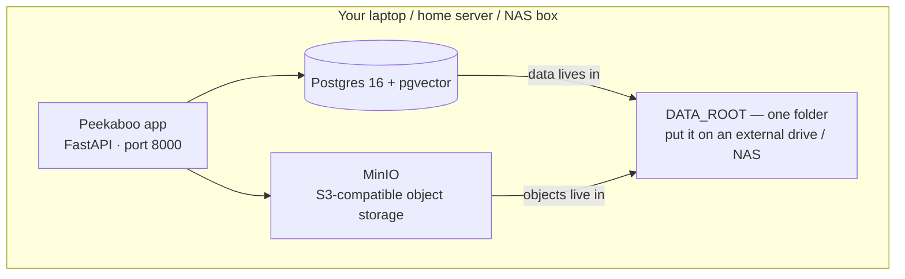

# 🖥️ Self-hosting — run Peekaboo on your own hardware

The whole product runs as **one Docker Compose suite** on a single machine: a
PostgreSQL + pgvector database, a MinIO S3-compatible object store (photos,
crops, selfies), and the Peekaboo app. All data lands under a single folder —
**`DATA_ROOT`** — so you can keep it on an external hard disk, a NAS mount, or a
home server, and move it between machines whenever you like.



## Quick start

```bash
cd Peekaboo
docker compose up -d --build
open http://localhost:8000          # landing page → create your account
```

First upload takes a minute or two: InsightFace's model pack (~370 MB) downloads
into the models volume on first use, then persists.

## Option A — storage on an external hard disk

Mount the drive, then point `DATA_ROOT` at it. Everything — photos, face crops,
the database, and the ML models — lives on that disk.

```bash
# e.g. an NTFS/exFAT/ext4 drive mounted at /mnt/photos
sudo mkdir -p /mnt/photos/peekaboo
DATA_ROOT=/mnt/photos/peekaboo docker compose up -d
```

Now the entire library is portable: unmount the drive, plug it into another
machine (or a fresh server), run the same command, and Peekaboo comes up with
all your photos and accounts intact. To move the whole stack:

```bash
# stop cleanly on the old machine
DATA_ROOT=/mnt/photos/peekaboo docker compose down
# plug the drive into the new machine and start there
DATA_ROOT=/mnt/photos/peekaboo docker compose up -d
```

> Windows users: set `DATA_ROOT=D:\peekaboo` (or wherever the drive mounts) in a
> `.env` file next to `docker-compose.yml` so you don't retype it.

## Option B — home server / NAS

Run the suite on the server; point `DATA_ROOT` at the NAS share (NFS/SMB mount).

```bash
DATA_ROOT=/mnt/nas/peekaboo APP_PORT=8080 docker compose up -d
```

- Other devices on your LAN reach it at `http://<server-ip>:8080`.
- The MinIO console is at `http://<server-ip>:9001` (login `minioadmin` /
  `minioadmin` — change both via `MINIO_ROOT_USER` / `MINIO_ROOT_PASSWORD`).
- For the internet: put it behind a reverse proxy (Caddy/Nginx) with HTTPS and
  set `PUBLIC_BASE_URL=https://your.domain` so claim links are absolute.

## Why MinIO (S3) instead of raw disk?

Peekaboo's storage layer speaks **S3**. That's what makes the storage swappable:
the "disk" is a service, not a fixed path. The same suite can point at MinIO on
your external drive, MinIO on a NAS, or a cloud S3 service — **zero code
changes**, just env vars:

| Where your files live | Set this | Notes |
|---|---|---|
| External drive / NAS (MinIO) | `STORAGE_BACKEND=s3`, `AWS_ENDPOINT_URL_S3=http://minio:9000` | this compose suite, default |
| Local raw disk (no MinIO) | `STORAGE_BACKEND=local`, `DATA_DIR=/path` | single-node, simplest |
| Neon object storage | `STORAGE_BACKEND=s3` + Neon endpoint/keys | free tier, cloud |
| Cloudflare R2 | `STORAGE_BACKEND=s3` + R2 endpoint/keys | 10 GB free, $0 egress |

## Migrating an existing library

**Local disk → this suite (MinIO):** copy your old `data/` into the container
once, then the built-in migration uploads everything to MinIO:

```bash
# the app reads DATA_DIR for local objects; seed it with your old data/
docker compose cp ./data app:/app/data
docker compose exec app python scripts/migrate_local_to_s3.py
```

**Neon / R2 → MinIO (or between any S3 stores):** use `mc mirror`:

```bash
docker compose exec minio mc alias set neon <NEON_ENDPOINT> <KEY> <SECRET>
docker compose exec minio mc mirror --overwrite neon/pekaboo local/pekaboo
```

The reverse (MinIO → cloud) works the same way with the endpoints swapped.
Object keys (`photos/<uuid>.jpg`, `crops/<uuid>.jpg`) are identical everywhere.

## Backups

Because every byte lives under `DATA_ROOT`, your backup is one folder:

```bash
# stop, then copy the folder (or use your NAS sync tool)
DATA_ROOT=/mnt/photos/peekaboo docker compose down
rsync -a /mnt/photos/peekaboo/ backup-dir/
DATA_ROOT=/mnt/photos/peekaboo docker compose up -d
```

Or back up the Postgres database separately while running:

```bash
docker compose exec db pg_dump -U peekaboo peekaboo > peekaboo.sql
```

## Tuning for weak hardware

Small home servers / old laptops:

```bash
FACE_MODEL=buffalo_s DET_SIZE=512 MAX_IMAGE_SIDE=1024 \
  DATA_ROOT=/mnt/photos/peekaboo docker compose up -d
```

`buffalo_s` is a smaller face pack (~160 MB, slightly lower accuracy) and
`DET_SIZE=512` cuts detector CPU per photo roughly in half.

## Config reference

| Env var | Default | Purpose |
|---|---|---|
| `DATA_ROOT` | `./data` | **Where all storage lives** — point at your disk/NAS |
| `APP_PORT` | `8000` | Host port for the web app |
| `MINIO_PORT` / `MINIO_CONSOLE_PORT` | `9000` / `9001` | MinIO S3 API / web console |
| `POSTGRES_USER/PASSWORD/DB` | `peekaboo` | Local DB credentials (dev-only defaults) |
| `MINIO_ROOT_USER/PASSWORD` | `minioadmin` | MinIO credentials — change these |
| `BUCKET_NAME` | `pekaboo` | S3 bucket the app uses |
| `FACE_MODEL` / `DET_SIZE` | `buffalo_l` / `640` | Accuracy-vs-speed trade-off |
| `JWT_SECRET` | dev default | **Set a real one** (`openssl rand -hex 32`) |
| `PUBLIC_BASE_URL` | — | Absolute URLs when behind a domain |

## Troubleshooting

- **Port already in use** — `APP_PORT=8080 docker compose up -d` (or change the
  others) if something else owns 8000/9000/9001.
- **External drive permission errors** — ensure the mount is writable by the
  container user; on Linux try `sudo chown -R $(id -u):$(id -g) /mnt/photos/peekaboo`.
- **Slow first upload** — the InsightFace pack is downloading into the models
  volume; later uploads are fast.
- **Model pack lost** — only if you delete the `peekaboo-models` volume
  (`docker compose down -v`); it re-downloads on the next upload.

## Verifying the suite

```bash
# full smoke test against a running suite (landing, signup, upload, MinIO)
.venv/bin/python scripts/check_stack.py http://localhost:8000
```
