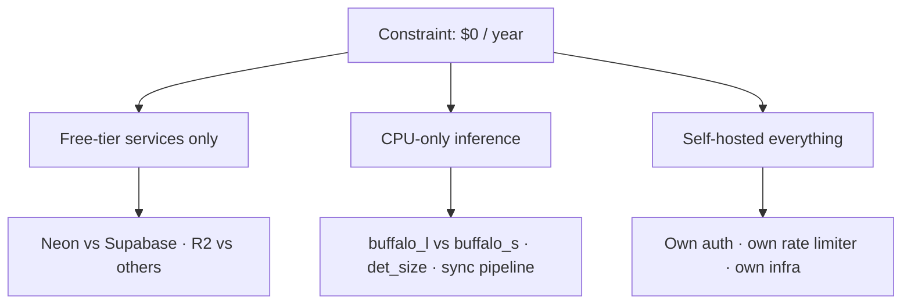
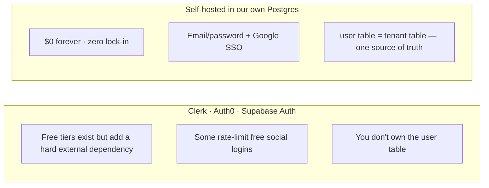
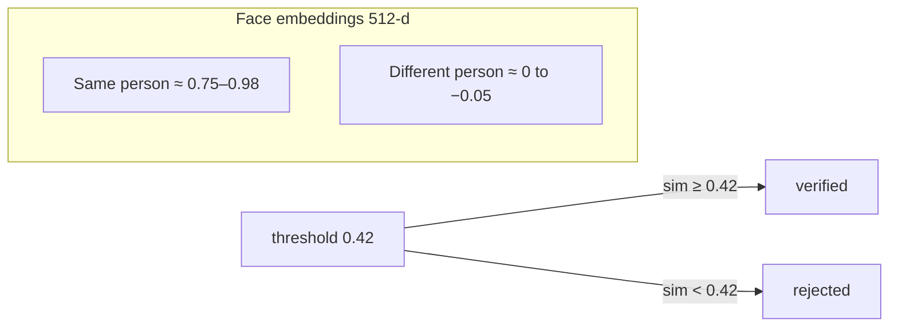
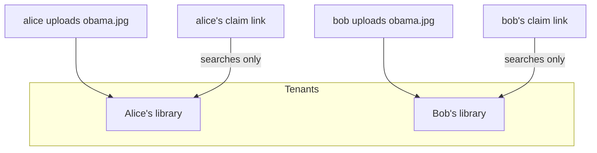

# ⚖️ Peekaboo — Engineering Tradeoffs

Every decision in this project was made against one hard constraint: **run a
production-grade face-recognition service for $0/year.** That constraint forces
a long series of tradeoffs — this file records *what* we chose, *why*, and
*what we gave up* so a future reader (or contributor) can revisit them with
full context.

The meta-tradeoff that shapes everything else:

---

## 1. Service & free-tier choices

### 1.1 Database: Neon (pgvector + HNSW) over Supabase

| | Neon (chosen) | Supabase |
|---|---|---|
| Free tier | 0.5 GB, ~100 CU-hrs/mo | 500 MB |
| Sleep behavior | **auto-wakes ~350 ms** after 5 min idle | **pauses after 1 week idle → manual restore** |
| pgvector + HNSW | ✅ | ✅ |
| Extras | Branching, autoscaling | Auth, Realtime, Edge Functions |

**Why:** both are Postgres with pgvector, so the app code is identical. The
decider is the sleep behavior — a sporadically-used photo app on Supabase
free would wake to a *dead database* after a week away, needing a manual
dashboard restore. Neon's 350 ms auto-wake is invisible to users.

**What we gave up:** one dashboard for everything (Supabase would also have
given us hosted auth and storage). We take on our own auth instead (see 1.3)
and our own storage (see 1.2).

### 1.2 Storage: Cloudflare R2 / MinIO over Supabase Storage

| | R2 (chosen) | Supabase Storage |
|---|---|---|
| Free tier | **10 GB + $0 egress** | 1 GB, 5 GB egress/mo |
| S3 API | ✅ (`/storage/v1/s3` style) | ✅ |
| Per-file limit | 5 GB | 50 MB |

**Why:** photo *serving* is the dominant traffic and R2's **zero egress**
means gallery views cost literally nothing, forever. MinIO locally speaks the
same S3 API, so the local↔prod path is byte-identical.

**What we gave up:** Supabase Storage's image transforms (we downscale
server-side instead) and its fine-grained access rules (we gate with tokens
in app code instead).

### 1.3 Auth: self-hosted (bcrypt + JWT) over Clerk / Auth0 / Supabase Auth

**Why:** we already own Postgres; a `users` table with bcrypt hashes and
hand-rolled JWT cookies is ~200 lines with no external call. Google SSO is a
standard OAuth 2.0 code flow done with `httpx`. Total cost: $0 and the user
table *is* the tenant table, which makes multi-tenancy trivial.

**What we gave up:** managed password resets, social-login UX polish (GitHub
etc.), MFA, and dashboard analytics. All are addable later without changing
the data model.

### 1.4 Local dev parity: Docker Postgres + MinIO

Chosen: `pgvector/pgvector:pg16` container + `minio/minio` container on the
laptop so dev exercises the exact production code paths (same SQL, same S3
API). Local disk (`STORAGE_BACKEND=local`) remains the zero-dependency
fallback.

---

## 2. AI / ML choices

### 2.1 Model pack: InsightFace `buffalo_l` vs `buffalo_s`

| | buffalo_l (laptop) | buffalo_s (deploy) |
|---|---|---|
| Size | ~370 MB | ~160 MB |
| Accuracy | best ArcFace weights | slightly lower |
| RAM / CPU | heavier | lighter |

**Why both:** one env var (`FACE_MODEL`) switches packs. The laptop runs
`buffalo_l` for maximum accuracy ("more resources" mode); free cloud hosts
switch to `buffalo_s` + smaller `DET_SIZE` ("deployment constraints" mode).

**What we gave up:** running `buffalo_l` in the cloud — free hosts have
0.5–2 GB RAM and the larger model eats cold-start time.

### 2.2 Detection + embedding: SCRFD + ArcFace on ONNX Runtime

- **SCRFD (`det_10g.onnx`)** for face detection — fast, accurate, MIT.
- **ArcFace (`w600k_r50.onnx`)** for a **512-d normalized embedding** — the
  industry-standard face representation; cosine similarity is the natural
  distance.
- **ONNX Runtime on CPU** — zero GPU cost. This is the single biggest reason
  the whole thing is free.

**What we gave up:** GPU latency (CPU inference is ~100–500 ms/face) and
bleeding-edge accuracy. We rejected heavier detectors (RetinaFace) for CPU
speed, and rejected cloud vision APIs (Google Vision, AWS Rekognition) — they
charge per image and would end the "$0" promise immediately.

### 2.3 Matching: cosine similarity ≥ 0.42 with pgvector HNSW

**Why 0.42:** measured live on sample data — comfortably between the
"same-person" band (0.75+) and the "different-person" band (≤ 0). It's
configurable (`MATCH_THRESHOLD`).

**HNSW index (`vector_cosine_ops`):** approximate nearest-neighbor search
turns a full-table scan into ~log-scale lookups. With 200-search-limit
candidates this is fast even at thousands of faces.

**What we gave up:** exact scan recall (HNSW is approximate — a *tiny* chance
of missing a true match at high recall pressure; negligible at this scale and
with `SEARCH_LIMIT=200`), and HNSW's in-memory index build cost on
insert-heavy workloads. Also: threshold tuning is inherently a
false-positive/false-negative trade — stricter = fewer wrong "you're in this
photo" results but more missed matches.

### 2.4 Synchronous inference vs a worker queue

**Chosen:** synchronous — upload endpoint runs detect+embed inline (FastAPI
threadpool keeps the event loop free).

**Why:** a Redis/Celery queue is a *second* free-tier service to babysit and
the latency is already ~1–2 s. **What we give up:** throughput under
concurrent uploads and resilience to crashes mid-processing. Documented as the
first upgrade path when traffic justifies it (see DEPLOYMENT.md).

---

## 3. Architecture tradeoffs

### 3.1 Multi-tenancy: `user = tenant`

Every `photos`/`faces` row carries `tenant_id`; *every* query filters on it
(verified live: two tenants uploading the same person see only their own).

**What we gave up:** an org/workspace model (a team sharing one library) — a
real product might need "family albums" later. The `tenant_id` column is
already the seam for that; today each user is their own tenant.

### 3.2 Claiming is anonymous (no account needed to claim)

The person in the photo claims their link with a selfie, no signup.

**Why:** it's the core product promise — zero friction for the person being
tagged. **What we gave up:** abuse resistance (selfie-spam against a public
link is only rate-limited, not account-gated) and the ability to contact
claimants. Mitigations: rate limiter on claims, 403-on-fail, audit selfies.

### 3.3 Claim tokens live in URLs

Each face gets a 128-bit (`secrets.token_urlsafe(18)`) token; the share link
is `/claim/<token>` and photo URLs carry `?token=`.

**Why:** URLs are the only share mechanism that works over WhatsApp/email
with zero signup. **What we gave up:** tokens appear in browser history,
referrer headers and server logs; anyone who sees the link can view the
photos it unlocks. Mitigations: token-gated serving, no token in any JSON
response body beyond the uploader's own, SameSite cookies don't apply here
(no cookies involved). A future "expiring links" feature would tighten this.

### 3.4 Sessions: stateless JWT in httpOnly cookies

- httpOnly + SameSite=Lax + optional Secure → JS can't read the token, CSRF
  on state-changing endpoints is mitigated.
- SameSite=Lax (not Strict) because the Google OAuth redirect needs cookies
  on a top-level GET navigation.

**What we gave up:** **server-side revocation** — `/logout` clears the cookie
but the JWT stays valid until expiry (30 days). For a photo app this is an
accepted tradeoff; the fix (session table or short-lived refresh tokens) is
documented in DEPLOYMENT.md. We also lose multi-device session management.

### 3.5 Rate limiter: in-memory, per-IP

A tiny sliding-window limiter (no Redis).

**What we gave up:** cross-worker coordination — with N uvicorn workers the
limit is effectively N×. It keys on `X-Forwarded-For` (first hop) only when
behind a proxy (`PUBLIC_BASE_URL` set), otherwise on `client.host`. This is
fine for a single-instance free deployment; a DB-backed limiter is the
upgrade path for horizontal scaling.

### 3.6 Storage backend: pluggable interface

`StorageBackend` interface (`save/read/exists/delete`) with `LocalStorage`
and `S3Storage` implementations, chosen at startup via `STORAGE_BACKEND`.

**What we gave up:** a dedicated CDN for photo delivery (R2's zero egress
makes it unnecessary at this scale) and per-object lifecycle rules. S3 keys
are strict-pattern validated (no path traversal).

### 3.7 Frontend: React SPA served by FastAPI

Vite + React + TypeScript, built to `web/dist` and mounted by the same app
(`/assets` static + catch-all that returns `index.html` — without swallowing
`/api/*`, which correctly 404s).

**Why:** one deployable unit (no separate hosting/CORS in prod); hot-reload
in dev via the Vite proxy on 5173. **What we gave up:** server-side
rendering (SEO — irrelevant for an authenticated app) and independent
scaling of frontend vs backend.

---

## 4. Privacy & security tradeoffs

| Decision | Gained | Given up / accepted |
|---|---|---|
| Store verification selfies | Audit trail for wrong/rejected claims | Holding biometric-adjacent data is a legal liability (GDPR/BIPA); needs retention policy |
| `MATCH_THRESHOLD` configurable | Operator can tighten/loosen | Default 0.42 isn't right for every dataset |
| bcrypt (12 rounds) for passwords | Cheap, well-understood, constant-time | Argon2id is the modern "best" — bcrypt chosen for the 72-byte check + broad support |
| Login always runs bcrypt (dummy hash for unknown emails) | No timing side-channel revealing registered emails | Slightly wasted CPU on every failed login |
| Passwords >72 bytes rejected at signup | Avoids bcrypt's silent truncation footgun | Users can't use very long passphrases (edge case) |
| Rate limiting by IP | Blocks brute force cheaply | Shared NAT / VPN users share a bucket |
| Trust `X-Forwarded-For` only behind proxy | Correct limiting in prod | An attacker who can reach the app directly (no proxy) can spoof the header |
| Startup warning on default `JWT_SECRET` | Fail-loud in prod | Still possible to deploy with the dev secret if ignored |

## 5. Operational tradeoffs

| Decision | Gained | Given up |
|---|---|---|
| Lazy model load (first request) | Fast cold start for `/health` | First upload is slow (~seconds) |
| `MAX_IMAGE_SIDE` 2048 laptop / 1024 deploy | Best detection accuracy | Bigger payloads / slower uploads |
| `MAX_UPLOAD_MB=20` | Bounds memory | Can't upload 4K videos/photos |
| Lightweight startup migration (`ALTER TABLE ... IF NOT EXISTS`) | Zero-migration-tooling friction | No versioned/rolled-back migrations — schema changes are one-way |
| Single uvicorn process | No state-sharing problems | No horizontal scaling (documented in DEPLOYMENT.md) |
| `docker` for local Postgres/MinIO | Exact prod parity | Requires Docker on the dev machine |

---

## The summary tradeoff

> **Peekaboo optimizes for: $0 forever, laptop-parity dev, and privacy-first
> claims — at the cost of horizontal scale, server-side session revocation,
> and managed-service conveniences.** Every one of those costs has a
> documented upgrade path; none requires an architecture rewrite.
